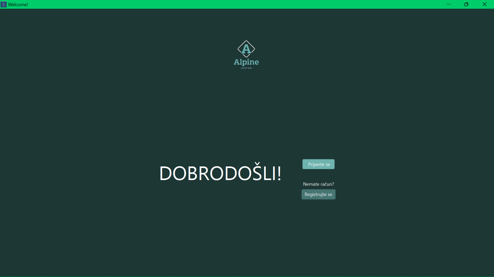
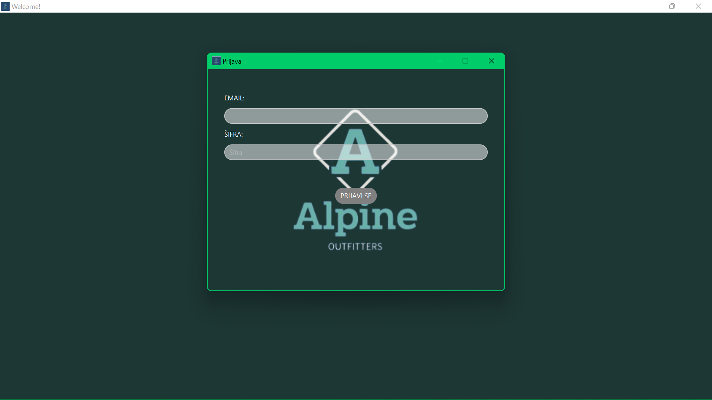
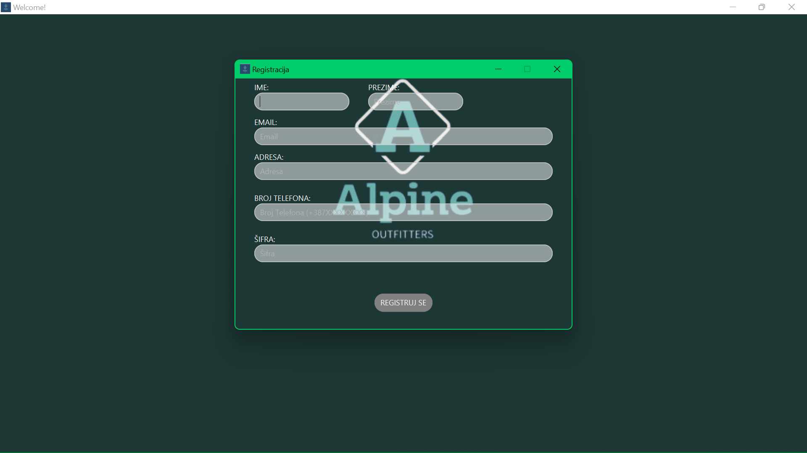
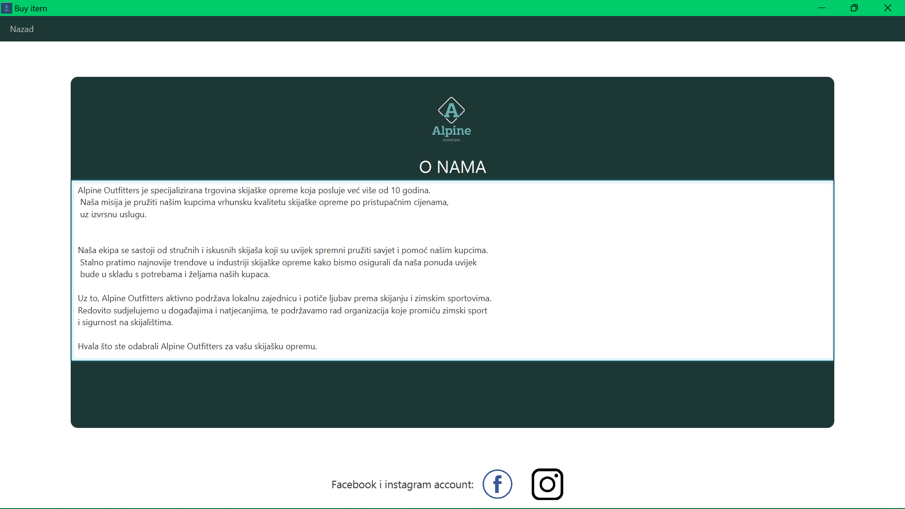
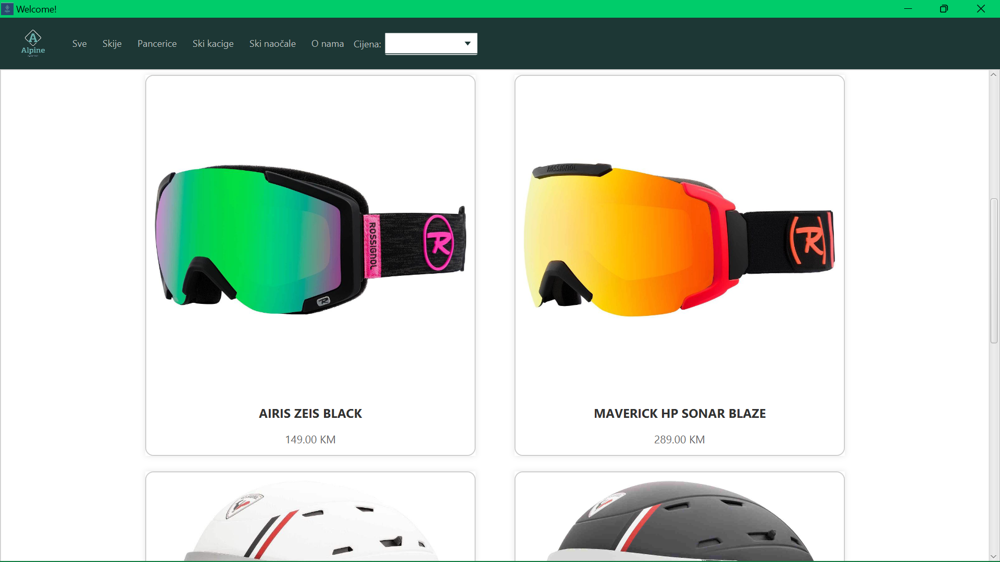
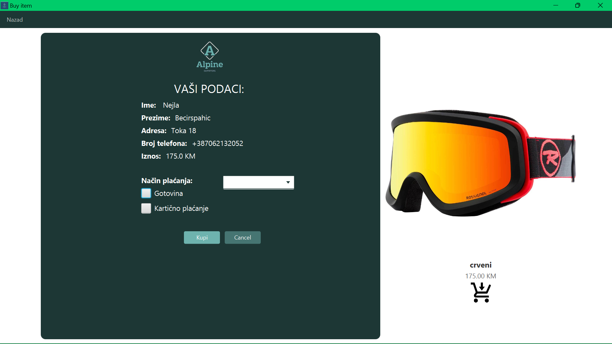

# Online kupovina skijaške opreme 

Online kupovina skijaške opreme je JavaFX aplikacija,
namijenjena da korisnicima omogući kupovinu skijaške opreme jednostavnom
i pristupačnom.

# Features
- Prijava i registracija korisnika
- Konekcija sa bazom podataka

# User Panel
User panel nudi sve potrebne informacije korisnicima
prilikom kupovine skijaške opreme.
Informacije koje su prikazane u User Panel-u:
- Naziv proizvoda
- Cijena proizvoda
- Slika proizvoda
- Informacije o kompaniji

# Getting started

Kako biste pokrenuli ovu aplikaciju, potrebno je da 
preuzmete repozitorij i prethodno instalirate (ukoliko već nemate instalirane) sljedeće softverske alate:
- Maven
- JDK 17
- MySQL

1. Klonirajte repozitorij na vaš lokalni računar pokretanjem sljedeće komande u komandnoj liniji:
```bash
git clone https://github.com/nbecirspah1/ProjekatRPR.git
```
2. U terminalu (može kroz okruženje) pokrenite program kucanjem sljedeće 2 komande:
```bash
mvn clean install
```
```bash
mvn clean javafx:run
```

## Built With
- IntelliJ IDEA
- Scene Builder
- MySQL Workbench

## Contact
Ukoliko imate neka pitanja ili povratne informacije,
slobodno nas kontaktirajte na 
<a href="mailto:nbecirspah1@etf.unsa.ba?subject=Question%20or%20Feedback">nbecirspah1@etf.unsa.ba</a>


Nadamo se da će Vam se naša aplikacija svidjeti!

## Screenshots

### Izgled početne stranice 


### Prijava 


### Registracija


### O Nama


### Izgled stranice nakon korisnikove prijave ili registracije


### Kupovina proizvoda 



